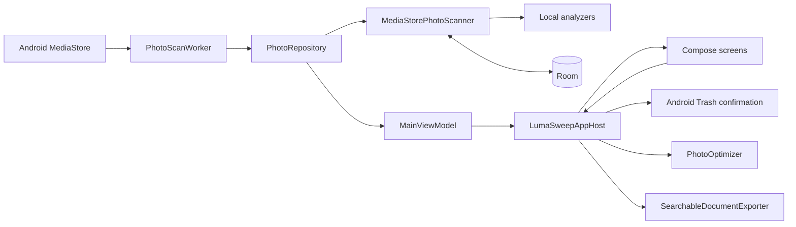
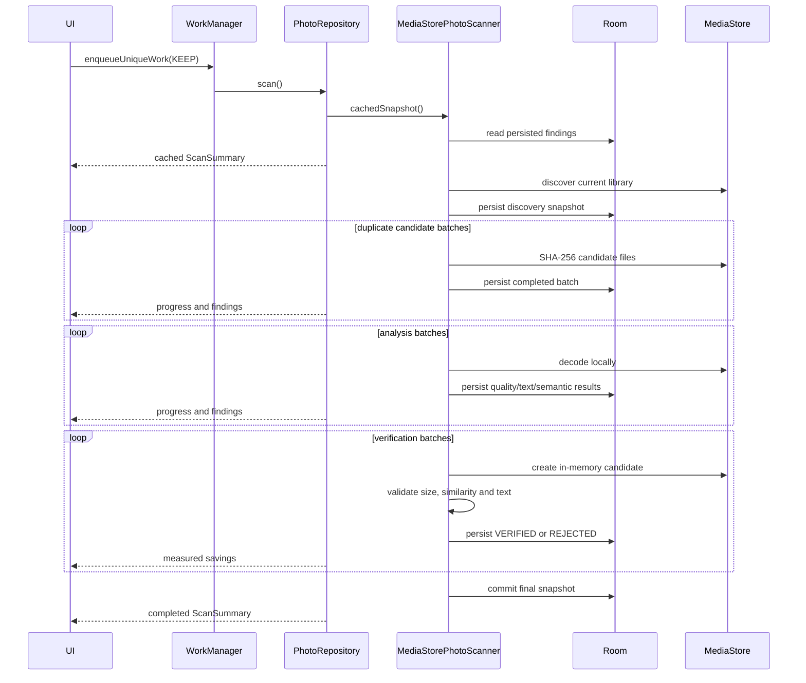
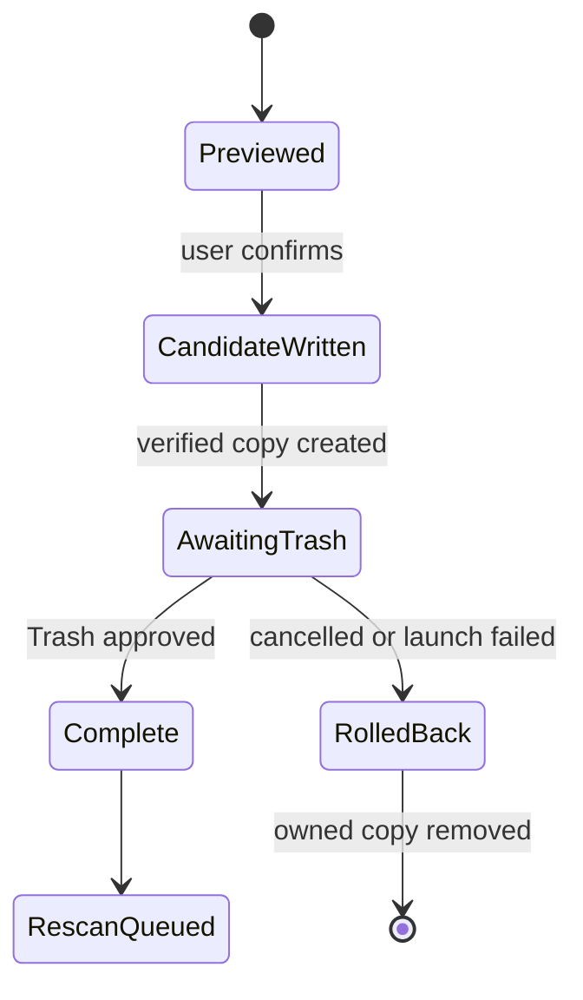

# LumaSweep system design

## 1. Goals

LumaSweep is a local-first Android photo cleanup application. It scans large libraries once, persists findings, represents confidence honestly, and lets the user recover space without an unsafe deletion path.

The system is designed around four constraints:

1. Review screens open immediately from persisted results; they never re-run library analysis.
2. Estimated savings and verified savings are different product concepts.
3. Every destructive decision ends at Android's system Trash confirmation.
4. Expensive work survives navigation and process interruption through WorkManager and Room.

## 2. High-level architecture

The dependency direction is UI → domain contracts → data/platform implementations. `AppContainer` is the process composition root and the only place where the concrete database, scanner, analyzer, repository, optimizer, and exporter are assembled.

## 3. Source boundaries

### Application and platform

- `MainActivity` owns only the Activity lifecycle and starts Compose.
- `PhotoStorageApplication` owns the process-scoped `AppContainer`.
- `AppContainer` constructs concrete dependencies without leaking construction into screens.
- `platform/PhotoAccess.kt` owns SDK-specific permission selection and access-level interpretation.
- `LumaSweepAppHost` is the Android action boundary. It owns Activity Result launchers, Trash transactions, generated-copy rollback, scan scheduling, and PDF-export feedback.

### Domain

- `PhotoModels.kt` defines immutable records, queue derivation, verified totals, and non-overlap rules.
- `ExactDuplicateEngine` verifies byte-identical groups from SHA-256-backed records.
- `OptimizationPolicy` defines quality presets, target dimensions, acceptance thresholds, and settings fingerprints.
- `SimilarityEngine` and `ScreenshotClassifier` derive subjective review categories.

The domain layer does not start activities, write media, or render UI.

### Data and analysis

- `MediaStorePhotoScanner` performs incremental discovery, duplicate hashing, local analysis, candidate encoding, verification, and persistence.
- `PhotoRepository` serializes scans with a mutex and exposes one `StateFlow<ScanSummary>`.
- `PhotoScanWorker` owns long-running/background execution and foreground progress.
- Room stores intermediate and completed results so UI can render cached findings immediately.
- `LocalImageAnalyzer` coordinates blur, perceptual similarity, OCR, semantic analysis, and candidate quality checks.
- `PhotoOptimizer` writes an owned optimized copy only after a user decision.

### Presentation

- `MainViewModel` loads cached results and exposes repository state.
- `PhotoStorageApp` owns navigation between top-level and review destinations.
- Feature screens own transient presentation state such as selection, filtering, preview position, and quality preset.
- `PhotoComponents.kt` contains shared preview/header/thumbnail primitives.
- `UiFormatters.kt` contains formatting and shared visual modifiers.
- `FindingKind.kt` provides one icon/color vocabulary across Home and Review.

## 4. Scan lifecycle

`ExistingWorkPolicy.KEEP` prevents duplicate background scans. The repository mutex is a second in-process guard. Batch persistence means interruption loses at most the current batch, not the entire scan.

## 5. Review and decision flow

1. Home shows review opportunity prominently and verified safe savings separately.
2. Review reads `ScanSummary`; no analyzer is called when a list opens.
3. Each photo receives one primary queue based on confidence priority: exact duplicate → verified lossless result → verified smaller copy → screenshot → similar → blurry.
4. Favorites and photos covered by a higher-confidence finding are excluded from subjective queues.
5. Multi-item screens maintain explicit selection and provide Select all/Deselect all.
6. Optimization presets regenerate and validate the preview; custom settings never reuse a default estimate as an actual result.
7. A final action asks Android to move originals to system Trash.

## 6. Safe optimization transaction

LumaSweep never replaces an original in place. It creates and verifies an app-owned copy first. If system Trash cannot be reached or the user cancels, every generated copy in that transaction is removed. Approval queues a refresh scan that measures the new library state.

## 7. Confidence and savings

- **Exact**: matching metadata candidate plus SHA-256 confirmation.
- **Verified optimization**: a real encoded candidate passed size, resolution, similarity, text, and policy checks.
- **Subjective**: similarity, screenshot grouping, or blur heuristics; these are review aids, not guaranteed savings.

Only exact duplicates and verified optimization output contribute to `verifiedTotalSavingBytes`. Subjective queue bytes contribute only to `reviewCandidateBytes` and are presented as “up to”.

## 8. Persistence and invalidation

Room database `photo-storage.db` stores one row per MediaStore item, including hashes, analysis version, semantic metadata, optimization proof, settings fingerprint, and verification state. Schema exports live in `app/schemas/`. Migrations are explicit and destructive fallback is disabled.

MediaStore identity and modification metadata allow unchanged rows to be reused. `LocalImageAnalyzer.ANALYSIS_VERSION` invalidates old analysis, while an optimization settings fingerprint forces re-verification when the default policy changes.

## 9. Privacy and security

- The manifest does not request internet access.
- Photo analysis, OCR, semantic inference, hashing, and encoding run on-device.
- Raw images are not stored in Room.
- Permanent deletion is not exposed; Android Trash remains the authority.
- Generated output is rolled back on incomplete optimization transactions.
- Full previews are bounded to a 4096-pixel long edge to reduce memory pressure.

## 10. Performance

- Incremental discovery reuses unchanged rows.
- SHA-256 runs only for duplicate candidates.
- Analysis results are versioned and reused.
- Progress and persistence are batched to avoid per-photo database/UI churn.
- Review lists use persisted records and lazy Compose containers.
- WorkManager keeps scans alive outside the foreground UI.

## 11. Failure handling

- Scan failures keep the latest persisted snapshot available and expose an error state.
- Concurrent scan requests are coalesced rather than duplicated.
- Rejected optimization candidates are never selectable as verified savings.
- Partial bulk output is removed if any step fails before Trash confirmation.
- Activity-mediated pending state is saveable across configuration recreation.

## 12. Architectural invariants

1. A review screen never starts discovery or analysis.
2. Only `VERIFIED` candidates are actionable.
3. A photo appears in at most one subjective queue.
4. UI totals never label subjective bytes as guaranteed savings.
5. Originals are never overwritten in place.
6. Generated files are rolled back when confirmation is incomplete.
7. Long scans belong to WorkManager; durable results belong to Room.
8. Compose never manually recycles bitmaps retained by display lists.
9. Filters scope bulk selection to the visible category.
10. New categories define confidence, queue priority, persistence, and overlap tests.

## 13. Testing

- Domain unit tests cover duplicate grouping, screenshot classification, optimization policy, and queue/savings rules.
- `testDebugUnitTest` is required for every change.
- `lintDebug` validates Android and Compose integration.
- `assembleDebug` proves packaging and Room schema generation.
- Device smoke tests cover permission variants, recreation, Trash approval/cancellation, custom quality previews, and large libraries.

See [README.md](README.md) for setup and [docs/FOLDER_STRUCTURE.md](docs/FOLDER_STRUCTURE.md) for the repository map.
